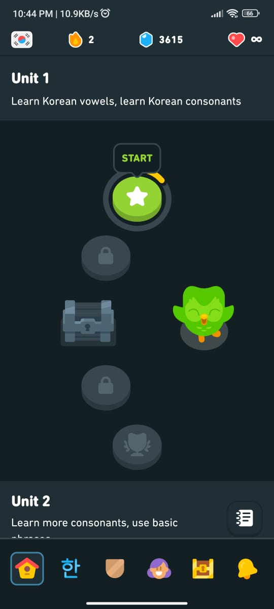
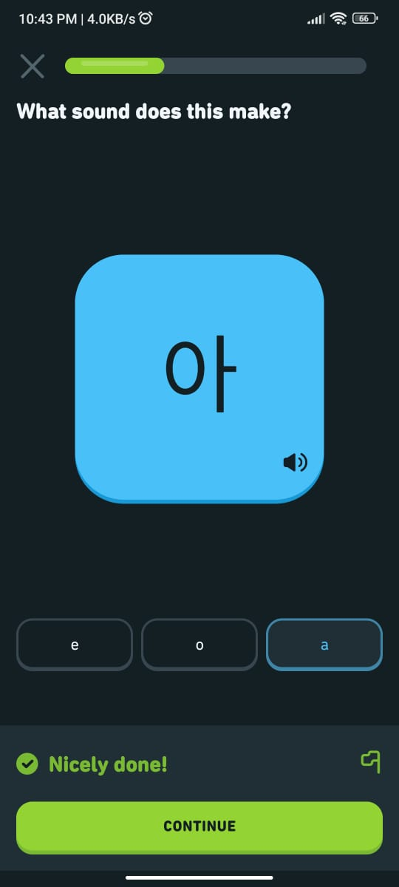
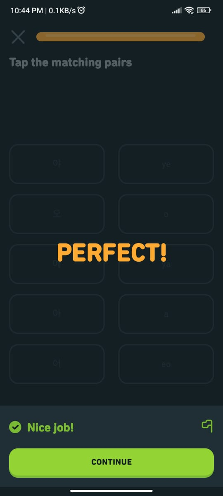
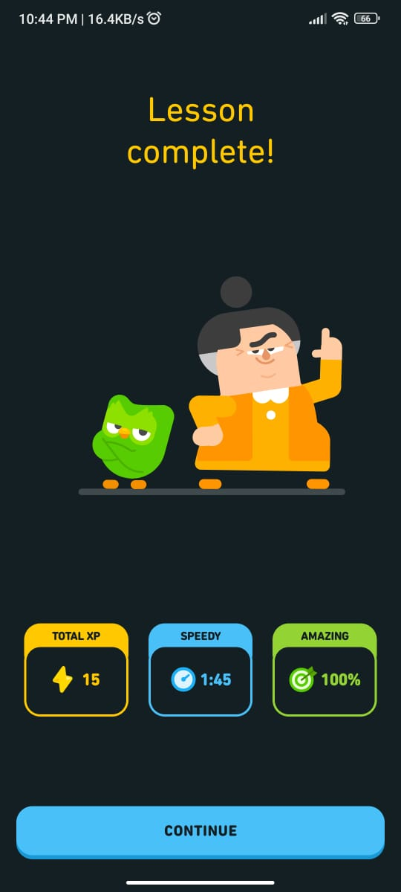

## Introduction
Duolingo is an online language-learning platform that offers free courses in over 30 different languages. Overall, the objective of the Duolingo application is to provide an effective and accessible language-learning platform that enables users to achieve their language-learning goals in a fun and engaging way.

**Why you as a user would love learning with Duolingo?**
1. Our courses effectively and efficiently teach reading, listening, and speaking skills.
2. Personalized learning : Combining the best of AI and language science, lessons are tailored to help you learn at just the right level and pace.
3. Stay motivated: We make it easy to form a habit of language learning, with game-like features, fun challenges, and reminders from our friendly mascot, Duo the owl.
4. Have fun with it! Effective learning doesn’t have to be boring! Build your skills each day with engaging exercises and playful characters.

## User Constrains and Assumptions
### Constraints:
**Language Availability**: Duolingo's language offerings may be limited by the availability of course contributors and resources.

**Limited Accessibility**: Duolingo's platform may not be accessible to users who do not have access to the internet connection or a compatible device.

**Limited Language Proficiency**: The effectiveness of Duolingo's platform may be limited for users who have very limited exposure to the target language.

**Limited Course Quality**: The quality of some courses may be inconsistent due to the varying levels of course contributors' expertise and experience.

### Assumptions:
**User Device Compatibility**: Duolingo assumes that users will have access to a compatible device, such as a smartphone or computer, to access the platform.

**User Proficiency**: Duolingo assumes that users have some basic knowledge of the language they are learning and will be able to understand the instructions and explanations provided in the course.

**Course Quality**: It assumes that the courses available on the platform are of good quality and have been created by knowledgeable and experienced contributors.

**User Motivation**: Duolingo assumes that users are motivated to learn the language they have chosen and will actively engage in learning.

## User Requirements:
**Language Selection**: The user should be able to choose the language they want to learn from a comprehensive list of available languages. Here the users should be able to access the application in a certain language to be able to understand and communicate with the app.

**User Profile**: The users can create and manage their personal profile with information such as their name, email, password, and language learning progress.

**Learning Materials**: Duolingo provides interactive learning materials such as grammar lessons, vocabulary exercises, listening, and speaking practices, but this requires the user to have an active internet connection.

**Learning Progress Tracking**: The user should be able to track their progress in the course, including the completion of lessons, the time spent on each lesson, and their overall proficiency in the language. The users are expected to complete their daily missions and tasks to progress and take quizzes so that the application can offer personalized learning by adjusting the difficulty level of the lessons based on the user's learning pace and previous performance.

**Device Compatibility**: Duolingo should be accessible on mobile devices, or a computer with a compatible operating system to be able to learn on-the-go.

## User Flow
Persona - Srikesh is a student from a university who has accquired an interest in learnong Korean after watching Kdramas. He heard from his friends that Duolingo is an easy and effective way to learn a new language and hence has started his learning journey.

1. Once the Srikesh opens the mobile application, they are presented with the splash screen of Duolingo, with the owl mascot called Duo. 

2. If the Srikesh is not already loged in they are presented with the SignUp/Login screen. If they dont have an existing account they are required to create a new account using google account, facebook or using standard email and password. The user is required to enter the necessary information like the name, age, phone number, etc, which are validated as well. 

For an already existing user, they can signup with their existing credentials or through their registed phone number and OTP.

3. Next the user is presented with a home sceen where they can view their progress map for a particular language, simillarly other statistics like their streak scrore, points collected(Rubies), are also visiable on the header. 
The taskbar shows several icons representing the home page, current Leagues page, user profile page, achivements collected page and the ongoing feed.

4. For a new user they are required to select the language they want to learn from the available list. For an native english speaker, the user can view the languages they can learn, eg, Spanish, Italian, French, etc.
Hence Srikesh selects Korean as his language of choice.

5. Srikesh is now presented with a question in which he has to state his level of proficiency in the language. Since, he is a novice learner, he chooses the option that states that he is learning Korean for the first time.

6. Now he begins his journey to lean Korean. He is presented with a quiz in which he is taught the basic sounds and letters of the language, with the help of visual and hearing aids. To make the learnign journey intuitive, there are various question types like MCQ's, match the following and fill in the blanks.

With every question he answers, he is immediately informed of the result with the help of Duo, which provides motivational replies. 

7. When the quiz is completed with all questions correctly answered, Srikesh begings his streak scores and earns serveral points(XPs and Rubies), and the lesson is marked as completed. Again he is taken back to the progress map page, to start his new lesson or evaluate his progress. He is required to participate daily in the lessona nd quizes to maintain his streak. 

8. After going through months of materials and lessons, Srikesh is able to spreak, read and write basic Korean sentances which required for daily life usage.
